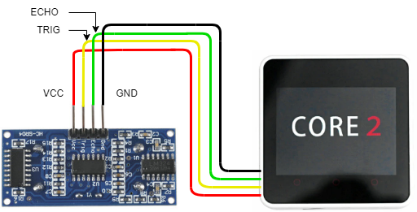
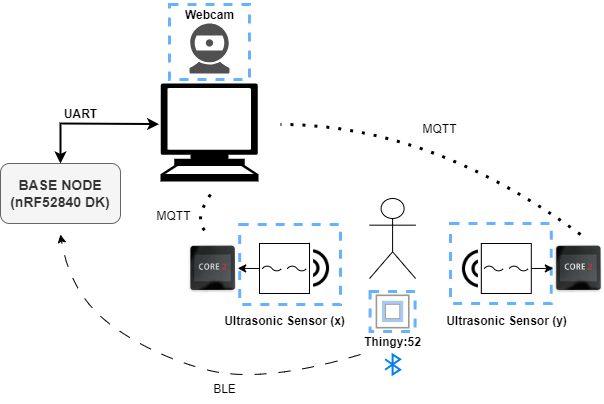

# Sensor Integration
The base node, nRF52840 DK, will be used to process all sensor data and form HID packets to send to the PC. The two forms of communication to the base node will be Bluetooth and USB-UART.

The sensors used are:

- Ultrasonic sensor (HC-SR04) x 2
- Nordic Thingy:52
- Webcam

### Ultrasonic sensor

The two ultrasonic sensors are integrated with the M5 Core2 to broadcast location information to the PC using MQTT. The HC-SR04 ultrasonic sounder has four pins: VCC, TRIG, ECHO, and GND. The PORT A header on the M5 Core2 is used to connect to the four pins on the ultrasonic sensor. Pins G32 and G33 on the M5 are connected to the ECHO and TRIG pins on the sensor. The M5's will receive distance information from the ultrasonic sensors and transmit the data to the PC using MQTT. Then, the location data will be processed and sent to the base node where a HID packet will be formed and sent back to the PC.

  

### Thingy:52

The Nordic Thingy:52 uses the nRF52832 Bluetooth 5 SoC to connect to the base node. The project will use the Thingy:52's integrated push button for performing actions in the game. The Thingy:52 will tramsit the push button status to the base node where it will be processed and sent to the game as a command in the form of a HID packet.

### Webcam

The built-in computer webcam will be used to capture video for the gesture recognition function. A Machine Learning algortihm will be implemented to process the video captured by the webcam and correlate a gesture with a command in the game. Machine Learning will be implemented on the PC and the data will be sent to the base node via UART for processing. If necessary, a USB webcam will be used to improve the quality of the video.

### System Sensor Integration

The figure below shows the overall system integration and all sensors are outlined with a blue dashed box.

  